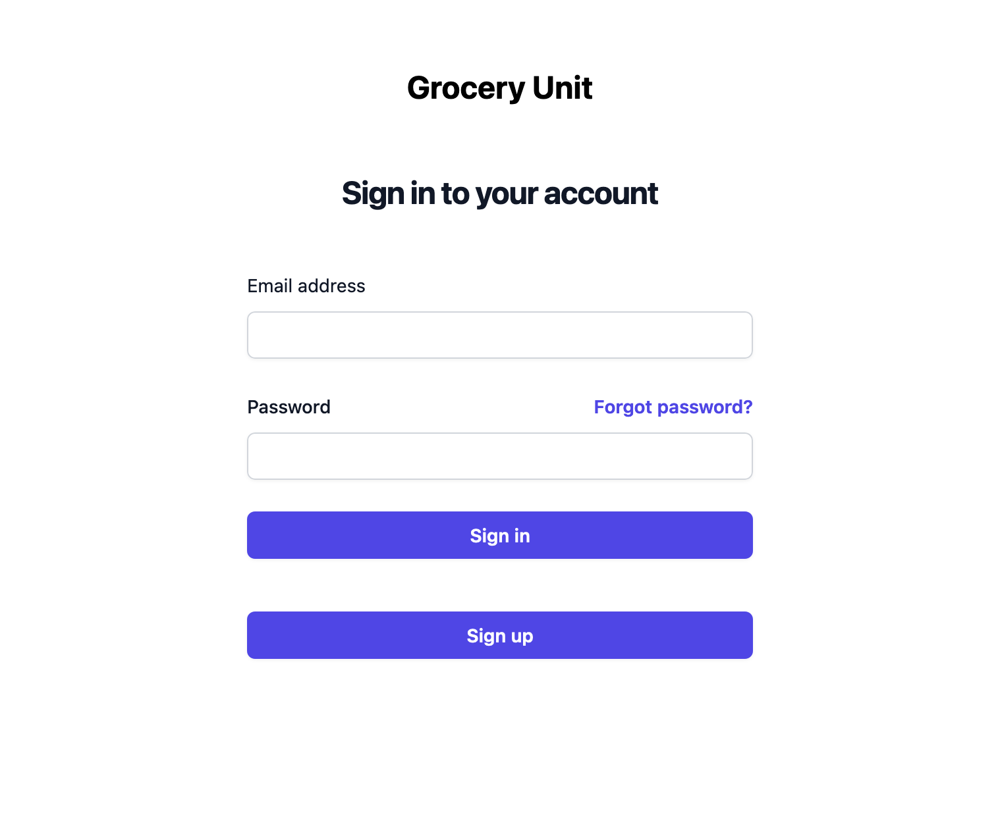
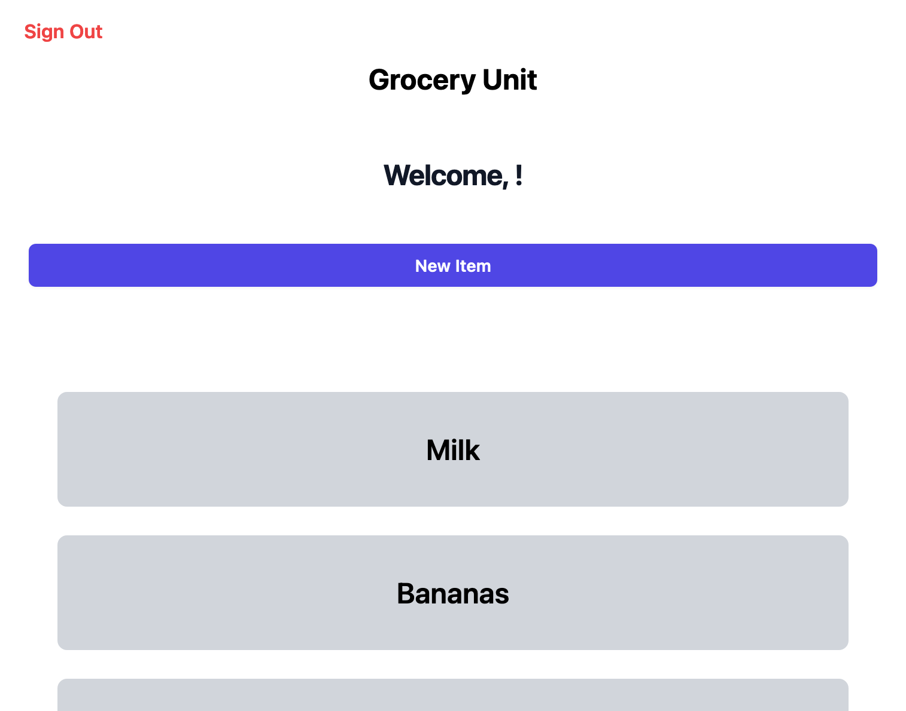
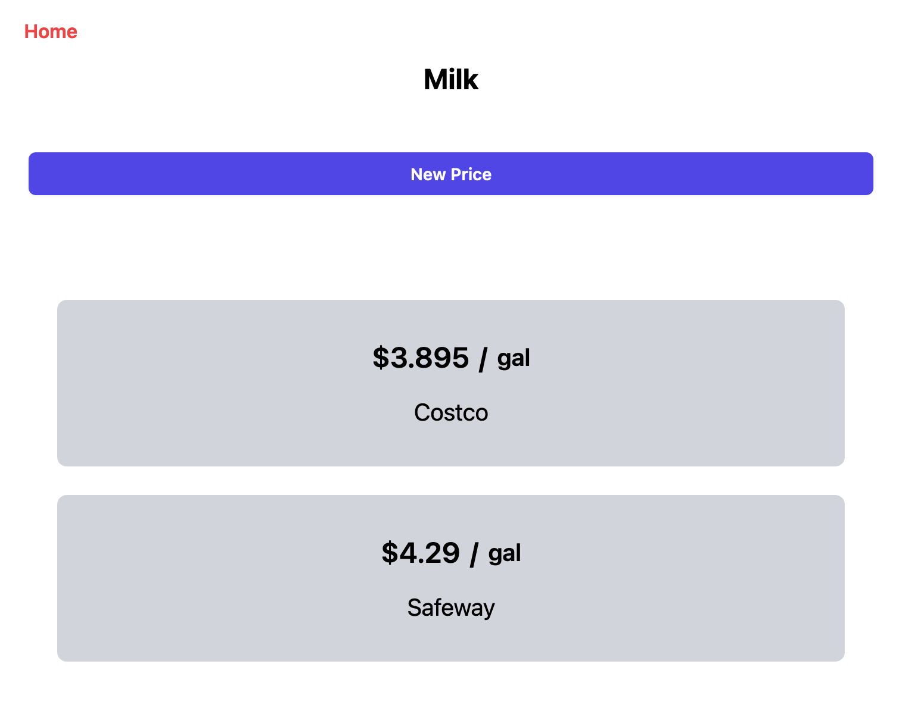
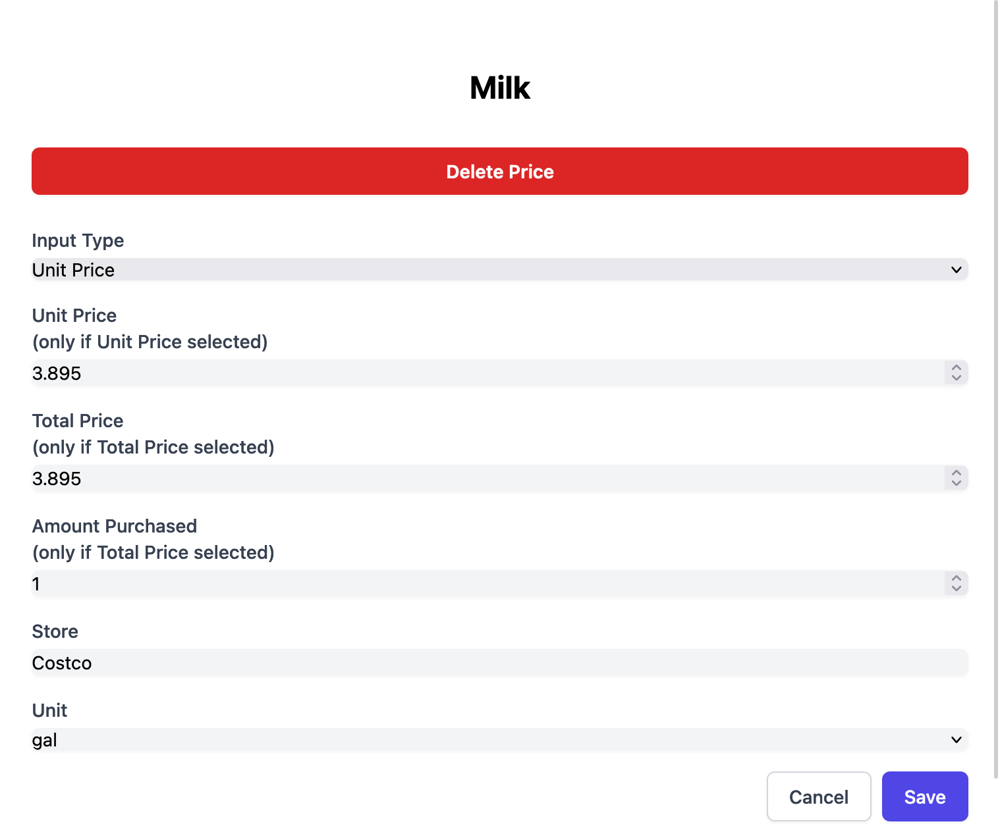

# Grocery Unit

This is a web app built with React + Vite

## Details

The app allows the user to add items they commonly purchase from the store and add them to their list. Furthermore, the user can add prices from specific locations and retailers with for each item,  by either the unit price, or the total price and the unit price will be calculated for them. This allows the user to be able to easily see where the cheapest location is to purchase any given item.

### Technology
**Front-End:** React, Vite, Tailwind

**Back-end:** Supabase BaaS

### Demo

Login Screen:

Home Screen:

Product Screen:

Price Edit Screen:

